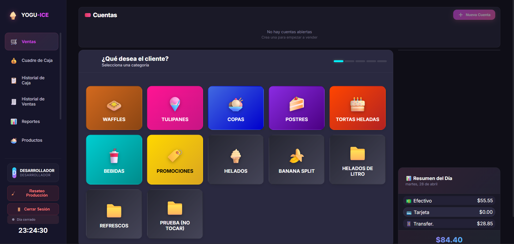
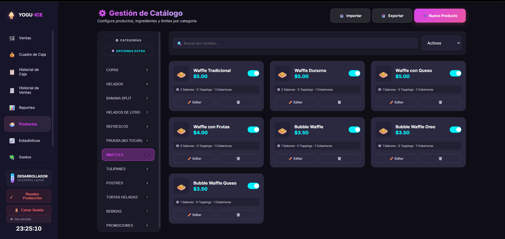
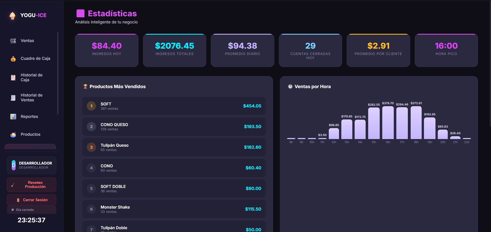
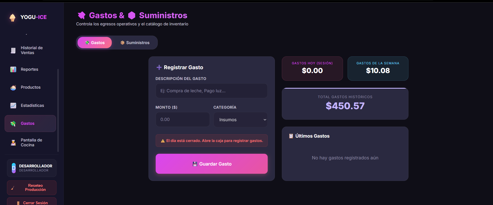

# 🍦 YoguIce — Sistema POS para Heladerías
 
> Sistema web de punto de venta desarrollado para una heladería real en Quito, Ecuador.  
> Gestión de ventas, caja, catálogo, estadísticas y gastos — todo en una sola herramienta.
 
 
## 📸 Vista del sistema
 

  
  

 

  
  

 
---
 
## ¿Qué es YoguIce?
 
YoguIce es un sistema POS (punto de venta) web construido para gestionar las operaciones diarias de una heladería. No es una página informativa — es software real que reemplazó procesos manuales en un negocio activo con ventas registradas de más de **$2,000**.
 
Desarrollado, desplegado y vendido a un cliente real. Opera actualmente en múltiples sucursales.
 
---
 
## ✨ Funcionalidades
 
| Módulo | Descripción |
|--------|-------------|
| **Ventas** | Selección rápida por categorías para atender clientes en mostrador |
| **Cuadre de Caja** | Apertura, cierre y control de efectivo/tarjeta/transferencia por turno |
| **Historial** | Registro completo de ventas y movimientos de caja |
| **Catálogo** | Gestión de productos con categorías, precios, sabores y toppings |
| **Estadísticas** | Dashboard con ingresos, productos más vendidos y ventas por hora |
| **Gastos** | Control de egresos operativos categorizados (insumos, servicios, etc.) |
| **Multi-sucursal** | Arquitectura preparada para operar en distintas sedes |
 
---
 
## 🛠 Stack tecnológico
 
| Capa | Tecnología |
|------|-----------|
| Frontend | HTML, CSS, JavaScript |
| Diseño | UI/UX propio optimizado para uso en mostrador |
| Datos | Arquitectura cliente — persistencia local |
 
---
 
## 📊 Datos reales del sistema en producción
 
- **$2,076** en ingresos totales registrados
- **361 ventas** del producto más vendido (Soft)
- **29 cuentas** atendidas en un solo día
- **$2.91** ticket promedio por cliente
- Hora pico identificada: **16:00**
---
 
## 🏪 Contexto del proyecto
 
| | |
|--|--|
| Tipo | Proyecto comercial real |
| Cliente | Heladería YoguIce, Quito - Ecuador |
| Estado | En producción activa |
| Sucursales | Matriz + Carapungo |
| Año | 2026 |
 
---
 
## 💡 Aprendizajes clave
 
- Diseñar para usuarios no técnicos que operan bajo presión en caja
- Iterar con el cliente en base a uso real, no requisitos académicos
- Gestionar módulos interdependientes (caja, ventas, estadísticas)
- Entregar y mantener software funcionando en producción
---
 
## Autor
 
**Andrés Quisilema** — Estudiante de Ing. en Sistemas · Quito, Ecuador  
[GitHub](https://github.com/Andr3sss) · [Email](mailto:quisilemaandres2@gmail.com)
